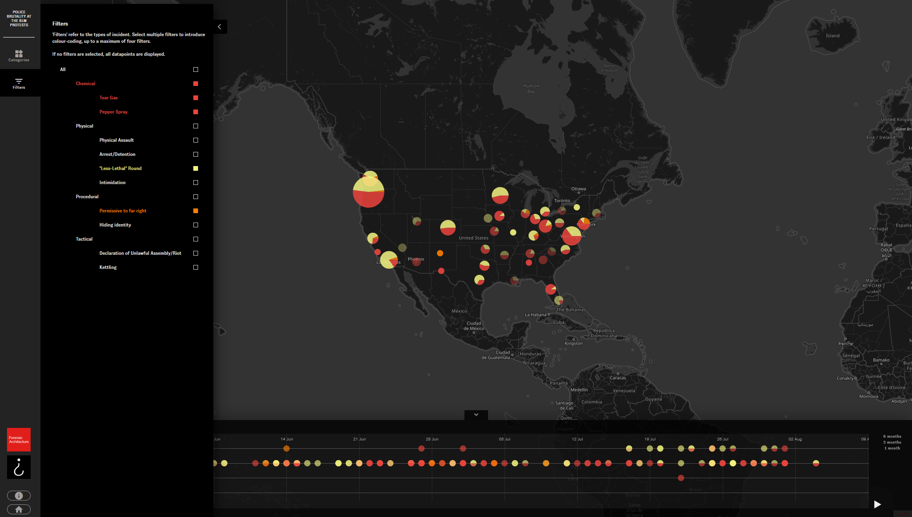

<h1 align="center">
  TimeMap v0
</h1>

<p align="center">
  <strong>TimeMap is a tool for exploration, monitoring and classification of incidents in time and space.<br>See a <a href="https://ilovaisk.forensic-architecture.org">live instance here</a>.</strong><br>
</p>



[](https://travis-ci.com/forensic-architecture/timemap)

## Overview

TimeMap is a standalone frontend application that allows to explore and monitor events in time and space. TimeMap uses OpenStreetMap satellite imagery as a backdrop by default, but can also be configured to use [mapbox](https://www.mapbox.com/). It uses Leaflet and d3 to visually map information.

The recommended way to run a backend for timemap is using [datasheet-server](https://github.com/forensic-architecture/datasheet-server). This allows you to work with a spreadsheet or Google Sheet as a dynamic database for for timemap.

TimeMap has the following high-level features capabilites:

* Visualize incidents of particular events on a map.
* Visualize and filter these incidents over time, on an adjustable timeline that allows to zoom in and out.
* Visualize types of incidents by tag and by category, which can be displayed using different styles.

A fully-functioning live version can be found as a result of the Forensic Architecture investigation of the [Battle of Ilovaisk](https://ilovaisk.forensic-architecture.org).

## Get up and running

These easiest way to get up and running with timemap and datasheet-server is to
[follow the tutorial here](https://forensic-architecture.org/investigation/timemap-for-cartographic-platforms).

### Instructions

1. Pull this repository.

```shell
git clone https://github.com/forensic-architecture/timemap
```

2. Install dependencies via yarn (recommended, it's just faster) or npm.

```shell
yarn          # npm install
```

3. Run it via yarn.

```shell
yarn dev      # npm run dev
```

To run with a file that is not 'config.js' in the root directory, set the `CONFIG` environment variable:
```
CONFIG="myotherconfig.js" yarn dev
```

IMPORTANT: Although the application will run _just like that_, in order for TimeMap to be able to display interesting information, you'll have to make sure to have the capacity to serve data, as well as adjusting some configuration parameters. See next section.

#### Running without datasheet-server 

Technically, timemap is backend agnostic, but it requires a series of endpoints to provide data for it to visualize. The data is expected in JSON format. Some data elements are required and their format has some required fields. Other additional endpoints are optional, and if enabled, they simply add features to your taste.

The combination of all these data types is called the `domain` of the application in the context of TimeMap.

## Contribute

### [Code of Conduct](CODE_OF_CONDUCT.md)

Please read before contributing. We endeavour to cultivate a community around timemap and other OSS at Forensic Architecture that is inclusive and respectful. Please join us in this!

### [Contributing Guide](CONTRIBUTING.md)

Learn more about our development process,  i.e. how to propose bugfixes and improvements.

## Community
If you have any questions or just want to chat, please join our team [fa_open_source](https://keybase.io/team/fa_open_source) on Keybase for community discussion. Keybase is a great platform for encrypted chat and file sharing that we use as a public forum.

## [License](LICENSE.md)

timemap is distributed under the [DoNoHarm license](https://github.com/raisely/NoHarm).
